# Darkdump OSINT Suite — Threat Intelligence Workstation

<p align="center">
  
</p>

<p align="center">
  <strong>Unified Dark Web Reconnaissance, Topological Threat Intelligence & Forensic OSINT Suite</strong><br>
  An advanced cyber threat intelligence platform re-engineered from the ground up into a high-performance modern stack.<br>
  Built with <strong>Laravel 11, Vue 3, Inertia.js v2, Tailwind CSS, SOCKS5h Tor Routing, and STIX 2.1</strong>.
</p>

<p align="center">
  
  
  
  
  
  
  
  
  
  
  
</p>

---

## 🔎 Overview

The **Darkdump OSINT Suite** is an enterprise-grade digital threat intelligence workstation engineered for security analysts, incident responders, and cyber investigators. Originally designed as a terminal Python script, this project has been completely re-architected into a scalable, asynchronous, and reactive web platform.

Featuring pure-PHP SOCKS5h Tor proxy routing, real-time Server-Sent Events (SSE) telemetry streaming, a reactive Bento-Grid intelligence matrix, interactive topological entity link graphs, zero-API-key social scraper modules, and one-click TLP:AMBER forensic Markdown and STIX 2.1 exports.

---

## ⚡ Key Features

### 🧅 Multi-Engine Dark Web Reconnaissance (`/search`)
- **Multi-Engine Aggregation:** Concurrently interrogates **Ahmia** (clearnet-filtered darknet), **TorDex** (deep web indexer), **OnionLand** (Tor + I2P), and **DuckDuckGo** (clearnet).
- **Live SSE Telemetry Stream (`/search/stream`):** Dispatches real-time execution logs, progress ticks, and newly discovered hits directly to the client without page reloading.
- **Ahmia Blacklist Integration:** Automatically cross-checks onion links against Ahmia's abusive site database to protect the operator.
- **Cryptographic Deduplication:** Real-time fingerprinting and normalization across onion mirror duplicates and redundant titles.

### 🕷️ Target Deep Scraper & Forensics (`/scraper`)
- **Pure PHP DOM Crawler:** Inspects hidden `.onion` services and clearnet web targets without heavy external browser dependencies.
- **Multi-Pattern Regex Email Harvesting:** Uncovers obscured email addresses across raw DOM elements, mailto protocols, and inline script tags.
- **Document & Secret Extraction across 45+ Extensions:**
  - *Databases & Keystores:* `.sql`, `.db`, `.sqlite`, `.kdbx` (KeePass password databases)
  - *Documents & Text:* `.pdf`, `.docx`, `.xlsx`, `.csv`, `.txt`, `.log`, `.md`, `.epub`
  - *Binaries & Archives:* `.zip`, `.tar.gz`, `.rar`, `.7z`, `.exe`, `.apk`, `.bin`
- **NLTK NLP Keyword Analysis:** 179-word stopword filtering to isolate high-value tactical keywords and threat indicators.
- **Sentiment & Threat Polarity:** Evaluates text subjectivity, tone, and suspicious operational vocabulary.
- **Link Topology Mapping:** Automatically parses internal site architecture versus outbound third-party link exposures.
- **Forensic Headless Screenshotting:** Captures visual proof of target onion web pages with one click.
- **OPSEC Image Proxying:** Proxies target assets through the backend to protect operator IP addresses from leaking.

### 🌐 Multi-Vector OSINT Reconnaissance Hub (`/osint`)
- **Username Footprinting (`/osint/username`):** Real-time asynchronous probing across 40+ social, code, forum, and gaming platforms (GitHub, Reddit, Twitter/X, Telegram, Steam, Keybase, HackerNews, GitLab, etc.) via live SSE streaming.
- **Email Intelligence (`/osint/email`):** MX record verification, disposable/temporary email detection, SMTP ping validation, automated breach dork synthesis, and Gravatar profile resolution.
- **IP & MAC Address Intelligence (`/osint/ip`):** BGP ASN lookup, RDAP geolocation, Reverse DNS resolution, Shodan-style open port scanning, WiGLE wireless network MAC tracking, and IEEE OUI hardware vendor resolution structured in dynamic Bento-Grid intelligence containers.
- **Domain & DNS Reconnaissance (`/osint/domain`):** Comprehensive DNS record harvesting (A, AAAA, MX, TXT, NS, SOA, CNAME), WHOIS registrar lookup, SPF/DMARC email security compliance auditing, and HTTP security header evaluation (CSP, HSTS, X-Frame-Options).

### 🕵️ Social Media & Threat Actor Footprinting (`/social-recon`)
- **Automated Google Dorks Generator:** Generates high-impact Google Dorks targeting credential pastes, stealer logs, config exposures, and threat actor aliases.
- **Zero-API Telegram Scraper:** Scrapes public channel messages, media previews, timestamps, view counts, and channel metadata (`t.me/s/{channel}`) with zero API key or bot token requirement.
- **Reddit Intelligence Probe:** Searches subreddits, user submission histories, and comments via public JSON endpoints.

### 🕸️ Topological Entity Link Graph & Case Dossiers (`/investigations`)
- **Force-Directed Visual Link Graph:** Automatically maps connections between case files, onion domains, Telegram channels, crypto wallets, and emails with custom operator-drawn nodes and relational edges.
- **STIX 2.1 CTI Standard Export:** Exports investigation topology into Structured Threat Information Expression (STIX 2.1) JSON for SIEM, MISP, and enterprise TIP ingestion.
- **One-Click Forensic Markdown Dossier:** Compiles executive summaries, graph topology metrics, evidence catalogs, and query histories into professional TLP:AMBER Markdown reports.

### 🚨 Autonomous Recon Watchdog Monitors & Alert Center (`/monitors`)
- **Scheduled Background Monitors:** Continuously monitors designated queries and target URLs.
- **Intelligent Diff & Leak Detection:** Identifies new onion mirrors, altered titles, or credential leaks between check intervals.
- **Cyber Alert Center:** Live notification hub displaying unread counts, severity badges (`CRITICAL`, `HIGH`, `WARNING`, `INFO`), and operator resolution tools.

### 🛡️ Built-in Tor Proxy Daemon Controller & PWA
- **Daemon Lifecycle Management:** Auto-detects local Tor Browser installations, starts background daemons with isolated sandboxing (`--SocksPort 9050 --DataDirectory storage/tor_data`), and stops processes on demand.
- **Live Tor Status Badge:** Probes `check.torproject.org` to verify active proxy status and display current exit node IP.
- **Air-Gapped PWA Capability:** Workbox Service Worker caching allows investigators to review evidence and dossiers in offline or air-gapped environments.

---

## 🛠️ Tech Stack

| Layer | Technology | Description |
| :--- | :--- | :--- |
| **Backend Framework** | [Laravel 11](https://laravel.com/) (PHP 8.5) | Scalable backend engine, Eloquent ORM, SSE streaming, FormRequests, & Policies |
| **Frontend Framework** | [Vue 3](https://vuejs.org/) | Composition API with `<script setup>`, reactive state, and dynamic rendering |
| **SPA Bridge** | [Inertia.js v2](https://inertiajs.com/) | Modern SPA bridge eliminating client-side API boilerplate |
| **Styling & Icons** | [Tailwind CSS v3](https://tailwindcss.com/) + [Lucide Icons](https://lucide.dev/) | Dark cyber / OSINT design system with Bento-Grid containers |
| **Anonymity & Routing** | [Tor SOCKS5h](https://www.torproject.org/) + [Guzzle](https://docs.guzzlephp.org/) | Native proxy routing (`socks5h://127.0.0.1:9050` / `9150`) & Tor2web fallback |
| **Target Extraction** | [Symfony DomCrawler](https://symfony.com/doc/current/components/dom_crawler.html) | Pure-PHP DOM parser with multi-regex harvesting & stopword filtering |
| **Database & Cache** | [MySQL 8.4](https://www.mysql.com/) + [Redis](https://redis.io/) | Relational intelligence schema with Predis caching & queues |
| **Offline PWA** | [vite-plugin-pwa](https://vite-pwa-org.netlify.app/) (Workbox) | Air-gapped investigation persistence and service worker caching |
| **Bundler** | [Vite](https://vitejs.dev/) | Lightning-fast frontend asset compilation and HMR |

---

## 📋 Prerequisites

Before running the application locally, ensure you have the following installed:
- **PHP** >= 8.2 (tested on PHP 8.5) with `curl`, `openssl`, `pdo_mysql`, `mbstring`, `fileinfo`, `sockets`
- **Composer** >= 2.x
- **Node.js** >= 18.x and **npm**
- **MySQL** >= 8.0 (e.g. MySQL 8.4 via Docker, XAMPP, or native service)
- **Tor Browser** or **Tor Standalone Daemon** (Optional: required only for direct `.onion` searches and deep scraping)

---

## 🚀 Installation & Setup Guide

### 1. Clone the Repository
```bash
git clone https://github.com/ElijahDuero/ThreatIntelligence.git
cd ThreatIntelligence
```

### 2. Configure Environment
Copy the example environment file:
```bash
# Windows PowerShell:
Copy-Item .env.example .env

# macOS / Linux:
cp .env.example .env
```

Open `.env` in your text editor and ensure the database credentials match your local MySQL configuration:
```env
DB_CONNECTION=mysql
DB_HOST=127.0.0.1
DB_PORT=3306
DB_DATABASE=darkdump
DB_USERNAME=root
DB_PASSWORD=
```

### 3. Install Dependencies
```bash
# Install PHP dependencies
composer install

# Install Node.js dependencies
npm install
```

### 4. Generate Application Key
```bash
php artisan key:generate
```

### 5. Set Up the Database
Create an empty database named `darkdump` in MySQL:
```sql
CREATE DATABASE darkdump CHARACTER SET utf8mb4 COLLATE utf8mb4_unicode_ci;
```

Run database migrations and seed default development operators:
```bash
php artisan migrate --seed
```
*This populates all intelligence tables and creates standard local development operator accounts:*
- **Operator:** `operator@darkdump.local` | Password: `DarkDump@2026!`
- **Admin:** `admin@darkdump.io` | Password: `password`

### 6. Build Frontend Assets
```bash
# Compile production assets:
npm run build

# Or run Vite in development mode (Hot Module Replacement):
npm run dev
```

### 7. Run the Application
Start the Laravel development server:
```bash
php artisan serve --port=8080
```
Visit your workstation at: **[http://127.0.0.1:8080](http://127.0.0.1:8080)**

*(On Windows, you can also launch the entire platform with one click via `run.bat`)*

---

## 🧭 Workstation Navigation & Portals

The application provides specialized cyber intelligence hubs accessible directly from the cyber sidebar and header:

| Module / Portal | Route | Description | Key Capabilities |
| :--- | :--- | :--- | :--- |
| **Command Dashboard** | `/` | Operational overview HUD | Active Tor exit IP, quick search metrics, recent alerts, recent cases |
| **Multi-Engine Dark Web** | `/search` | Darknet & Clearnet query engine | Live SSE stream, Ahmia, TorDex, OnionLand, DuckDuckGo, deduplication |
| **Target Deep Scraper** | `/scraper` | Full DOM crawler for `.onion` & web | 45+ file discoveries, email extraction, NLTK NLP, screenshot capture |
| **Username Recon** | `/osint/username` | Persona platform enumerator | 40+ social/developer/gaming sites via live Server-Sent Events |
| **Email Intelligence** | `/osint/email` | Email validation & breach dorking | MX record lookup, disposable filter, SMTP probe, breach dorks |
| **IP & MAC Intelligence** | `/osint/ip` | Network & hardware footprinting | BGP ASN, RDAP geo, Shodan port scan, Bento-grid threat matrix, WiGLE MAC |
| **Domain & DNS Recon** | `/osint/domain` | DNS & email security audit | DNS records (A/MX/TXT), WHOIS registrar, SPF/DMARC, security headers |
| **Social Media Recon** | `/social-recon` | Threat actor footprinting | Google Dork builder, zero-API Telegram channel scraper, Reddit probe |
| **Infrastructure Recon** | `/infra-recon` | Server & network topology | Reverse IP lookups, shared host detection, direct entity graph pivot |
| **Investigation Dossiers** | `/investigations` | Case files & visual topology | Force-directed entity link graph, STIX 2.1 CTI export, Markdown dossier |
| **Query History Registry** | `/queries` | Operational audit trail | Search history logs, bulk management, CSV/JSON evidence export |
| **Recon Watchdogs** | `/monitors` | Autonomous surveillance | Scheduled background polling, diff tracking, cyber alert center |

---

## 🧅 Tor Configuration & OPSEC Best Practices

Clearnet searches (e.g. DuckDuckGo, public OSINT probes, DNS) work immediately out of the box without Tor.

To search and deep-scrape hidden `.onion` services:
1. Ensure the Tor daemon is running on SOCKS5 port `9050` (or Tor Browser on port `9150`).
2. Alternatively, start the daemon directly from the UI or via Artisan:
   ```bash
   php artisan tor:start
   ```
3. The workstation header features a live Tor connectivity badge that automatically verifies routing through `https://check.torproject.org/api/ip` and displays your current exit IP address.
4. If Tor is offline, onion requests automatically route through hardened Tor2web gateways (`.onion.pet` / `.onion.ws`).

---

## 🧪 Running Automated Tests

The application includes a comprehensive test suite (129+ tests and 1,570+ assertions) covering authentication, scrapers, OSINT modules, monitors, and security validators:

```bash
# Run tests with PHPUnit:
vendor/bin/phpunit

# Or via Laravel Artisan:
php artisan test
```

---

## 📁 Project Structure

```text
ThreatIntelligence/
├── app/
│   ├── Http/
│   │   ├── Controllers/          # Workstation controllers (Search, Scraper, Osint, Social)
│   │   ├── Middleware/           # Inertia handling, authentication gates
│   │   └── Responses/            # ServerSentEventStream for real-time telemetry
│   ├── Models/                   # Eloquent models (Investigation, Bookmark, SearchQuery)
│   └── Services/
│       ├── DarkWeb/              # TorClient, DeepScraperService, AhmiaBlacklistService
│       ├── Infrastructure/       # InfrastructureReconService, Reverse IP, Ports
│       ├── Investigation/        # EntityGraphService (STIX 2.1 CTI & Markdown Dossiers)
│       ├── Monitors/             # ReconMonitorService (Scheduled Watchdogs & Alerts)
│       ├── Osint/                # Username, Email, Domain, & Bento-Grid IP Services
│       ├── Security/             # SafeUrlValidator (SSRF prevention & IP allowlisting)
│       └── SocialRecon/          # TelegramScraperService & SocialReconService
├── config/                       # Application configuration files
├── database/
│   ├── migrations/               # Database schemas with performance indexes
│   └── seeders/                  # Standard development operator seeders
├── public/                       # Public entrypoint, PWA icons, manifest
├── resources/
│   ├── css/                      # Tailwind CSS cyberpunk styles
│   └── js/
│       ├── Components/           # EntityLinkGraph, ScraperConsole, Bento panels
│       ├── Layouts/              # CyberLayout (Header HUD, Live Tor Badge, Nav)
│       ├── Pages/                # Inertia Vue 3 views (Search, Scraper, Osint, etc.)
│       └── Utils/                # Clipboard, kinetic scroll, and export helpers
├── routes/
│   ├── web.php                   # Authenticated workstation routes & SSE endpoints
│   └── console.php               # Tor daemon start/stop CLI commands
└── tests/
    ├── Feature/                  # Feature tests (Auth, Scraper, OSINT, Monitors)
    └── Unit/                     # Unit tests (Ahmia blacklist, Bento grouping)
```

---

## 🔒 Security & Safe Handling

- **SSRF Prevention:** All user-supplied target addresses pass through [`SafeUrlValidator`](app/Services/Security/SafeUrlValidator.php) before fetching to block private IP spaces, link-local addresses, and cloud metadata endpoints (`169.254.169.254`).
- **Anonymity Isolation:** Remote target images and previews are proxied through backend controllers to prevent operator IP leaks.
- **Traffic Classification:** Investigation dossiers default to `TLP:AMBER` marking for responsible threat intelligence handling.
- **Zero Secret Commits:** Verified `.gitignore` blocks real environment configs, Tor cache directories (`storage/tor_data`), and execution logs.

---

## 📄 License

This project is licensed under the [MIT License](LICENSE).
